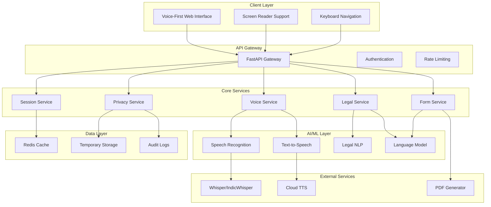
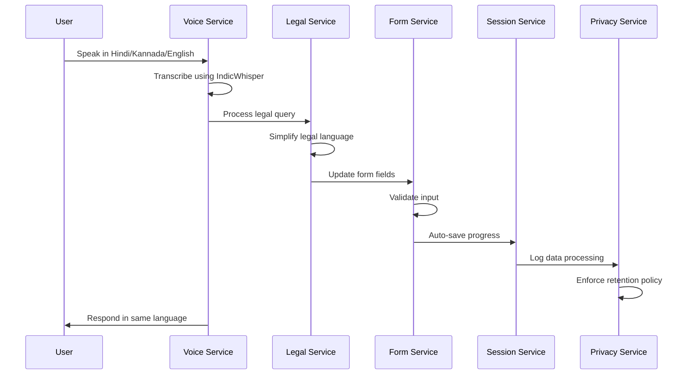
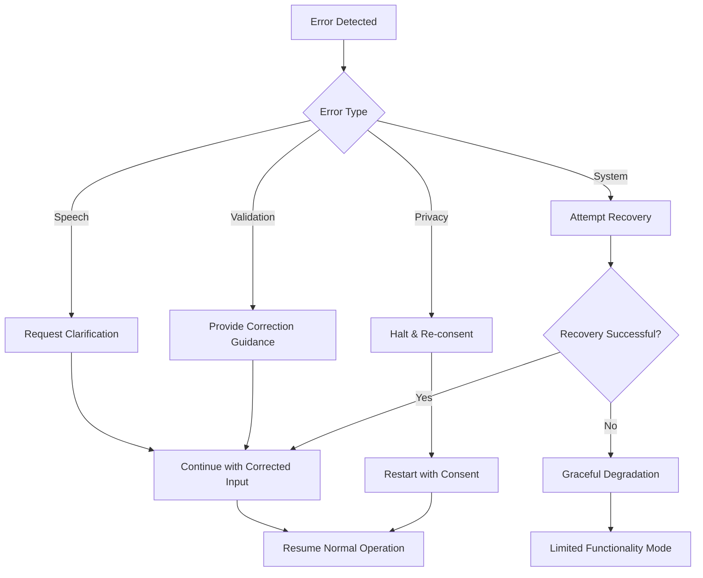

# Design Document: AI-Powered RTI Voice Assistant

## Overview

The AI-powered RTI Voice Assistant is a comprehensive accessibility-first application designed to democratize access to India's Right to Information (RTI) process for visually impaired and motor-disabled users. The system employs a voice-first interaction paradigm with multilingual support (English, Hindi, Kannada) to guide users through RTI application completion, legal guidance, and document generation.

The architecture follows a microservices approach with clear separation between voice processing, legal guidance, form generation, and privacy management components. The system prioritizes accessibility compliance, DPDPA 2023 adherence, and maintains session-based data retention with automatic purging for privacy protection.

## Architecture

### High-Level Architecture



### Component Architecture

The system is organized into distinct service layers:

1. **Client Layer**: Accessibility-focused web interface with comprehensive screen reader support
2. **API Gateway**: Centralized request handling with authentication and rate limiting
3. **Core Services**: Business logic microservices for voice, legal, form, session, and privacy management
4. **AI/ML Layer**: Specialized components for speech processing and legal language understanding
5. **Data Layer**: Temporary storage with automatic purging and audit logging
6. **External Services**: Third-party integrations for speech processing and document generation

## Components and Interfaces

### Voice Service

**Responsibilities:**
- Speech-to-text conversion using IndicWhisper for Indian languages
- Text-to-speech synthesis with natural voice output
- Language detection and switching (English, Hindi, Kannada)
- Audio quality optimization for accessibility

**Key Interfaces:**
```typescript
interface VoiceService {
  transcribeAudio(audioBlob: Blob, language?: string): Promise<TranscriptionResult>
  synthesizeSpeech(text: string, language: string, voice?: VoiceOptions): Promise<AudioBlob>
  detectLanguage(audioBlob: Blob): Promise<LanguageDetectionResult>
  setVoicePreferences(userId: string, preferences: VoicePreferences): Promise<void>
}

interface TranscriptionResult {
  text: string
  confidence: number
  language: string
  timestamp: number
}
```

**Implementation Details:**
- Uses IndicWhisper models for Hindi and Kannada with 90%+ accuracy
- Implements prompt-tuning techniques for improved Indian language performance
- Supports real-time streaming for responsive interaction
- Includes noise reduction and audio preprocessing

### Legal Service

**Responsibilities:**
- RTI rights explanation in simple language
- Legal terminology simplification
- Procedure guidance for Central Government RTI
- Context-aware help and clarification

**Key Interfaces:**
```typescript
interface LegalService {
  explainRTIRights(language: string): Promise<SimplifiedExplanation>
  simplifyLegalTerm(term: string, context: string, language: string): Promise<Explanation>
  getProcessGuidance(step: RTIStep, language: string): Promise<GuidanceContent>
  validateRTIRequest(request: RTIRequest): Promise<ValidationResult>
}

interface SimplifiedExplanation {
  content: string
  keyPoints: string[]
  examples: string[]
  language: string
}
```

**Implementation Details:**
- Uses fine-tuned language models for legal text simplification
- Maintains context-aware conversation flow
- Provides step-by-step guidance aligned with RTI Act 2005
- Supports multilingual legal concept explanation

### Form Service

**Responsibilities:**
- RTI application form structure management
- User input validation and formatting
- Document generation (PDF/text formats)
- Form completion progress tracking

**Key Interfaces:**
```typescript
interface FormService {
  initializeForm(userId: string): Promise<RTIForm>
  updateFormField(formId: string, field: string, value: any): Promise<ValidationResult>
  generateDocument(formId: string, format: DocumentFormat): Promise<GeneratedDocument>
  validateForm(formId: string): Promise<FormValidationResult>
}

interface RTIForm {
  id: string
  applicantDetails: ApplicantDetails
  informationSought: InformationRequest
  publicAuthority: AuthorityDetails
  feeDetails: FeeInformation
  completionStatus: CompletionStatus
}
```

**Implementation Details:**
- Implements RTI Act 2005 compliant form structure
- Supports incremental form completion with validation
- Generates submission-ready documents with proper formatting
- Maintains form state across sessions

### Session Service

**Responsibilities:**
- User session lifecycle management
- Progress persistence and recovery
- Auto-save functionality
- Session timeout and cleanup

**Key Interfaces:**
```typescript
interface SessionService {
  createSession(userId: string): Promise<Session>
  saveProgress(sessionId: string, progress: SessionProgress): Promise<void>
  restoreSession(sessionId: string): Promise<Session | null>
  scheduleCleanup(sessionId: string, ttl: number): Promise<void>
}

interface Session {
  id: string
  userId: string
  currentStep: string
  formData: Partial<RTIForm>
  preferences: UserPreferences
  createdAt: Date
  lastActivity: Date
}
```

**Implementation Details:**
- Uses Redis for high-performance session storage
- Implements automatic cleanup after 24 hours
- Supports session recovery across browser sessions
- Maintains audit trail for privacy compliance

### Privacy Service

**Responsibilities:**
- DPDPA 2023 compliance enforcement
- Data encryption and secure processing
- Consent management
- Data retention and purging

**Key Interfaces:**
```typescript
interface PrivacyService {
  obtainConsent(userId: string, purposes: DataPurpose[]): Promise<ConsentRecord>
  encryptSensitiveData(data: any): Promise<EncryptedData>
  scheduleDataPurging(userId: string, retentionPeriod: number): Promise<void>
  generatePrivacyReport(userId: string): Promise<PrivacyReport>
}

interface ConsentRecord {
  userId: string
  purposes: DataPurpose[]
  consentGiven: boolean
  timestamp: Date
  withdrawalMethod: string
}
```

**Implementation Details:**
- Implements end-to-end encryption for sensitive data
- Maintains detailed consent records with withdrawal mechanisms
- Enforces automatic data purging policies
- Provides transparency through privacy reports

## Data Models

### Core Data Structures

```typescript
// User and Session Models
interface User {
  id: string
  preferredLanguage: LanguageCode
  accessibilityNeeds: AccessibilityProfile
  voicePreferences: VoiceSettings
  consentStatus: ConsentStatus
}

interface AccessibilityProfile {
  screenReaderUsed: boolean
  motorDisabilities: boolean
  preferredInteractionMode: 'voice' | 'keyboard' | 'hybrid'
  speechRate: number
  audioVolume: number
}

// RTI Application Models
interface RTIApplication {
  id: string
  applicant: ApplicantDetails
  publicAuthority: PublicAuthorityInfo
  informationSought: InformationRequest[]
  feePayment: FeeDetails
  submissionDetails: SubmissionInfo
  status: ApplicationStatus
}

interface ApplicantDetails {
  name: string
  address: Address
  contactInfo: ContactInformation
  identityProof?: IdentityDocument
  categoryStatus: ApplicantCategory // BPL, General, etc.
}

interface InformationRequest {
  description: string
  specificQuestions: string[]
  timeframe?: DateRange
  format: InformationFormat // Inspection, Copy, etc.
  urgency: UrgencyLevel
}

interface PublicAuthorityInfo {
  name: string
  department: string
  pioName?: string
  address: Address
  feeStructure: FeeInformation
}

// Language and Accessibility Models
interface MultilingualContent {
  english: string
  hindi: string
  kannada: string
}

interface VoiceSettings {
  language: LanguageCode
  voiceId: string
  speechRate: number
  pitch: number
  volume: number
}
```

### Data Flow Architecture



## Correctness Properties

*A property is a characteristic or behavior that should hold true across all valid executions of a system—essentially, a formal statement about what the system should do. Properties serve as the bridge between human-readable specifications and machine-verifiable correctness guarantees.*

Based on the prework analysis, the following properties capture the essential correctness requirements:

### Property 1: Language Detection and Consistency
*For any* audio input in English, Hindi, or Kannada, the system should automatically detect the language and maintain consistent language usage throughout the conversation, switching languages within 3 seconds when requested.
**Validates: Requirements 1.1, 1.3, 1.4**

### Property 2: Speech Transcription Accuracy
*For any* speech input in supported languages, the transcription accuracy should meet or exceed 90% and begin processing within 1 second of speech completion.
**Validates: Requirements 1.2, 10.1**

### Property 3: Offline Functionality Preservation
*For any* cached language model, basic transcription functionality should remain available when internet connectivity is lost, with clear indication of limited features.
**Validates: Requirements 1.5, 8.1, 8.4**

### Property 4: RTI Form Structure and Validation
*For any* RTI application form, questions should follow the logical RTI Act 2005 structure, validate all inputs immediately, and provide specific error correction guidance for invalid data.
**Validates: Requirements 2.1, 2.2, 9.1, 9.2, 9.3, 9.4, 9.5**

### Property 5: Legal Guidance Simplification
*For any* legal concept or RTI procedure query, explanations should be provided in simple, non-legal language specific to Central Government procedures with appropriate disclaimers.
**Validates: Requirements 2.3, 7.1, 7.2, 7.4, 7.5**

### Property 6: Session Management and Auto-Save
*For any* user input or section completion, data should be auto-saved within 2 seconds, preserved for 24 hours during interruptions, and allow session resumption for returning users.
**Validates: Requirements 2.4, 2.5, 4.1, 4.2, 4.3**

### Property 7: Document Generation Compliance
*For any* completed RTI form, the system should generate both PDF and text formats that include all RTI Act 2005 required fields and meet Central Government submission standards.
**Validates: Requirements 3.1, 3.2, 3.4, 3.5**

### Property 8: Document Verification Round-Trip
*For any* generated document, the system should read back the complete form content to the user for verification before final export.
**Validates: Requirements 3.3**

### Property 9: Privacy and Data Protection Compliance
*For any* data processing operation, the system should obtain explicit consent, use end-to-end encryption, enforce 24-hour maximum retention, provide deletion confirmation, and maintain DPDPA 2023 compliance.
**Validates: Requirements 4.4, 4.5, 6.1, 6.2, 6.3, 6.4, 6.5**

### Property 10: Comprehensive Accessibility Support
*For any* user interaction, the system should provide proper ARIA labels for screen readers, support standard keyboard navigation, allow audio control customization, provide audio descriptions for visual elements, and announce errors through multiple channels.
**Validates: Requirements 5.1, 5.2, 5.3, 5.4, 5.5**

### Property 11: Post-Completion Guidance
*For any* completed RTI application, the system should explain next steps, expected timelines, and submission procedures.
**Validates: Requirements 7.3**

### Property 12: Offline Data Synchronization
*For any* offline user input, data should be stored locally and automatically synchronized when connectivity is restored.
**Validates: Requirements 8.2, 8.3**

### Property 13: Connectivity-Based Feature Prompting
*For any* operation requiring full functionality, the system should prompt users to connect to the internet when operating in limited offline mode.
**Validates: Requirements 8.5**

### Property 14: System Response Performance
*For any* user input, the system should provide responses within 3 seconds and complete document generation within 10 seconds, with audio feedback during processing.
**Validates: Requirements 10.2, 10.3, 10.5**

<function_calls>
<invoke name="prework">
<parameter name="featureName">rti-voice-assistant

## Error Handling

### Error Classification and Response Strategy

The system implements a comprehensive error handling strategy that prioritizes accessibility and user guidance:

#### Speech Processing Errors
- **Low Confidence Transcription**: When transcription confidence falls below 80%, the system requests clarification rather than proceeding with potentially incorrect data
- **Language Detection Failures**: Falls back to user's preferred language setting and provides language selection options
- **Audio Quality Issues**: Provides specific guidance on improving audio input (microphone positioning, noise reduction)

#### Form Validation Errors
- **Missing Required Fields**: Announces specific missing information with examples of valid input
- **Invalid Data Format**: Provides format examples and allows voice-guided correction
- **Legal Compliance Issues**: Explains RTI Act requirements in simple terms with correction suggestions

#### System and Connectivity Errors
- **Network Failures**: Graceful degradation to offline mode with clear feature limitations
- **Service Timeouts**: Retry mechanisms with user notification and alternative interaction paths
- **Data Corruption**: Session recovery from last known good state with user confirmation

#### Privacy and Security Errors
- **Consent Violations**: Immediate halt of processing with clear explanation and re-consent options
- **Encryption Failures**: Secure fallback to local processing with user notification
- **Data Retention Violations**: Automatic purging with audit trail and user notification

### Error Recovery Mechanisms



## Testing Strategy

### Dual Testing Approach

The testing strategy employs both unit testing and property-based testing to ensure comprehensive coverage:

**Unit Testing Focus:**
- Specific examples of RTI form completion scenarios
- Edge cases for speech recognition (accented speech, background noise)
- Integration points between microservices
- Error condition handling and recovery paths
- Accessibility compliance verification with actual assistive technologies

**Property-Based Testing Focus:**
- Universal properties across all user inputs and system states
- Comprehensive input coverage through randomization (minimum 100 iterations per property)
- Cross-language consistency verification
- Performance characteristics under various load conditions
- Privacy compliance across all data processing scenarios

### Property-Based Testing Configuration

**Testing Framework**: Hypothesis (Python) for backend services, fast-check (TypeScript) for frontend components

**Test Configuration:**
- Minimum 100 iterations per property test
- Custom generators for Indian language text, RTI form data, and accessibility scenarios
- Performance benchmarks with statistical analysis
- Cross-browser and assistive technology compatibility testing

**Property Test Tagging:**
Each property test references its corresponding design document property:
- **Feature: rti-voice-assistant, Property 1**: Language Detection and Consistency
- **Feature: rti-voice-assistant, Property 2**: Speech Transcription Accuracy
- [Additional properties as defined above]

### Integration Testing Strategy

**End-to-End Scenarios:**
- Complete RTI application workflow in each supported language
- Session interruption and recovery testing
- Offline-to-online transition scenarios
- Multi-modal accessibility testing (voice + keyboard + screen reader)

**Performance Testing:**
- Concurrent user load testing with accessibility tools
- Speech processing latency under various network conditions
- Document generation performance with large form datasets
- Memory usage patterns during extended sessions

**Security and Privacy Testing:**
- DPDPA compliance verification through automated audits
- Encryption validation for all data transmission
- Data retention and purging verification
- Consent management workflow testing

### Accessibility Testing Requirements

**Automated Testing:**
- WCAG 2.1 AA compliance verification
- Screen reader compatibility (NVDA, JAWS, VoiceOver)
- Keyboard navigation path validation
- Color contrast and visual accessibility checks

**Manual Testing:**
- User testing with visually impaired participants
- Motor disability accommodation verification
- Voice interaction usability assessment
- Multi-language accessibility validation

The testing strategy ensures that the RTI Voice Assistant meets its accessibility-first design goals while maintaining robust functionality across all supported scenarios and user needs.